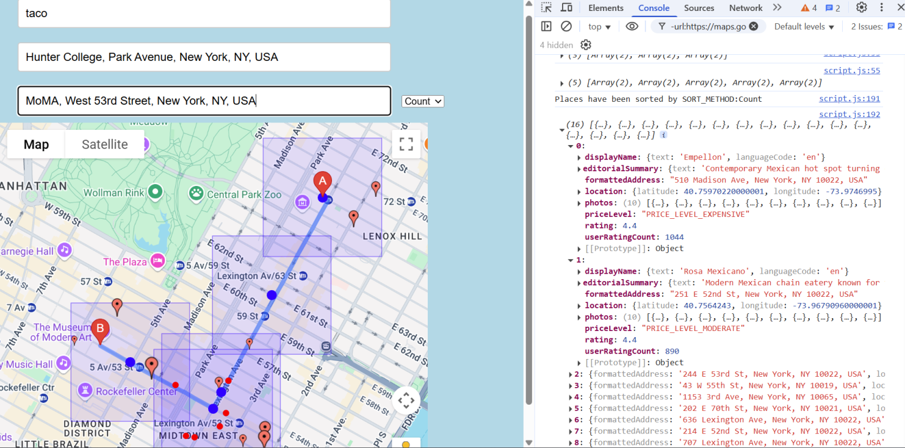

# Whats NEW!

Autocomplete from chris

TextSearch added from my Week 5 file

Search query input box for text search

Sort method dropdown box

All the places are stored in an array without duplicates and sorted

# CHECK OUT:
places_array by the end of the show_places function holds all the places that has been sorted. This is what is being console logged. 

# Explained by Image:

Route from A to B searching for 'taco' (all the taco places)

The places are sorted by Count, which is the amount of userRatingCount

The skinny/pink ish markers are the top 10 places, where larger marker implies more count

The red circles are the non-top 10 places

Check out the console log - it says Places have been sorted by Count, which could be changed by updating the SORT_METHOD variabe

# Project Setup Instructions

Before running the project, make sure you have **Node.js** installed. Then, install the necessary dependencies:

### Install dependencies:
```bash
npm install express
npm install dotenv
npm install nodemon
```
make a local .env file and put your own API key

it should look like the .env_sample file

then run:
```bash
nodemon server.js
```
*DO NOT UPLOAD YOUR .env FILE TO GITHUB*

Instead, make a .gitignore file and list your .env file in it (look at my .gitignore for reference)