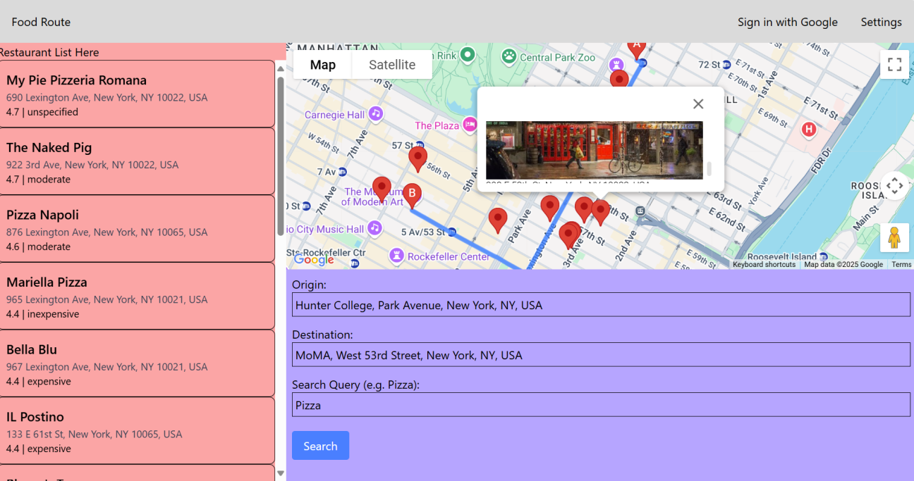

# New! Photos of Places


Using a new API call to Places Photo API, we can get the photo of places. 

The Places API returns us the information about the places including the photo url: 

(what is requested)
```js
headers: {
    "Content-Type": "application/json",
    "X-Goog-FieldMask": [
        "places.displayName",
        "places.location",
        "places.photos",
        "places.rating",
        "places.priceLevel",
        "places.formattedAddress",
        "places.userRatingCount",
        "places.editorialSummary"
    ]}
```

 places.photos stores photo urls, but this url cannot be directly accessed so we have to feed the url to the Places Photo API to get the actual image. 

 (This takes the first image)

 ```js 
 const firstPhoto = place.photos?.[0];
  const photoName = firstPhoto?.name;

  const photoUrl = photoName
    ? `https://places.googleapis.com/v1/${photoName}/media?maxWidthPx=400&key=${googleMapsAPIKey}`
    : null;
```

The function I changed here was in HomeContainer.tsx, inside the search_route() function