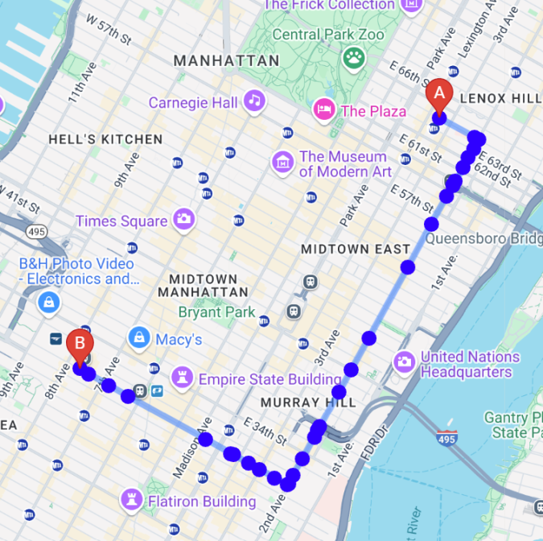

Running this would be pretty simple

Embed your API_KEY in the script source at the very top, and open preview

Everything is hardcoded in this test, so API Key is not secure at all. To use the API_KEY as an enviornment variable I will work to make this in a style similar to the implementation found in Week1 Folder

# What This File Does:
Given the origin and the destination, this file outputs the directions and the decoded polyline which is an array of coordinates along the way. 

Output: The direction search from Hunter College to Penn Station. The blue dots are coordinates along the way found by decoding the encoded polyline returned by directions API. Some of these coordinates are clustered together, so it is necessary to reduce some of these unnessassary points. 

