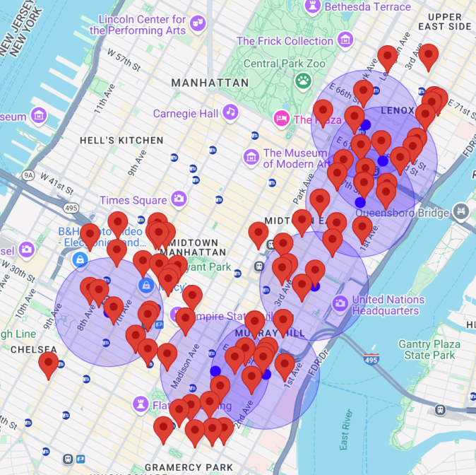

Running this would be pretty simple

Embed your API_KEY in the script source at the very top, and open preview

Everything is hardcoded in this test, so API Key is not secure at all. To use the API_KEY as an enviornment variable I will work to make this in a style similar to the implementation found in Week1 Folder

# What This File Does:

Given a set of coordinates (points along the route), this file calls the places API iteratively on each point. 

The places API will perform a nearby search based on the text query. 

The problem I am encountering now is that the search radius (defined by the RADIUS variable), does bias the search results but do not limit/restrict the search results within the radius. The search area is shown as a translucent blue circle. 

Thus, with this approach the returned array of places must be filtered through. 

Output: Nearby Place search on 7 coordinates along the route from Hunter College to Penn Station. 
