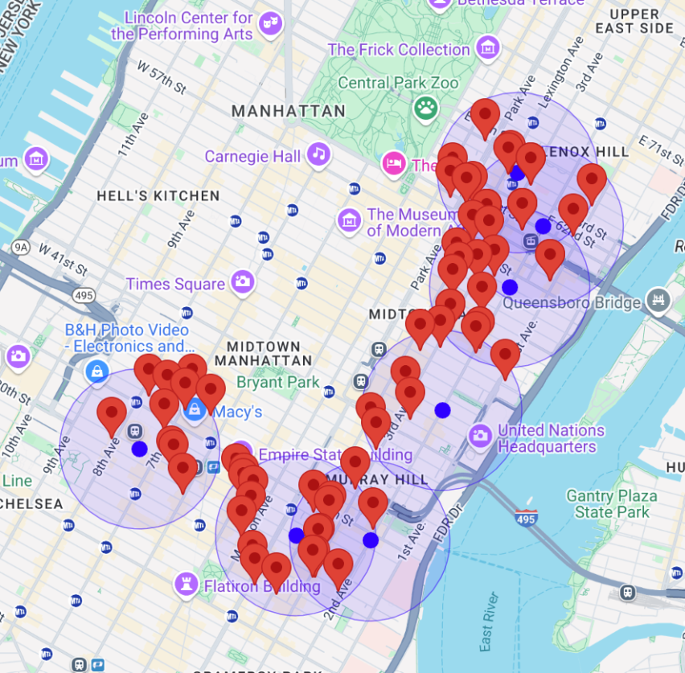

To run:

Embed your API_KEY in the script source at the very top, and open preview

Everything is hardcoded in this test, so API Key is not secure at all. Make sure to remove it if you are going to upload some copy of this file. 

# What This File Does:

Given a set of coordinates (points along the route), this file calls the places API iteratively on each point. 

The places API will perform a nearby search based on the TYPE (e.g. restraunt) 
This is a category that already exists for for the API

This approach solves the problem of the previous week, and search results are actually restricted to the radius. 

Output: Nearby Place search on 7 coordinates along the route from Hunter College to Penn Station. 

In this file, the coordinate points are hardcoded (there are 7 predefined coordinates), and the map is centered around Hunter college. One thing to consider is making the coordinates (2D array) an input feature, and finding the optimum center of the map and zoom so that fits the entire route and search area. 