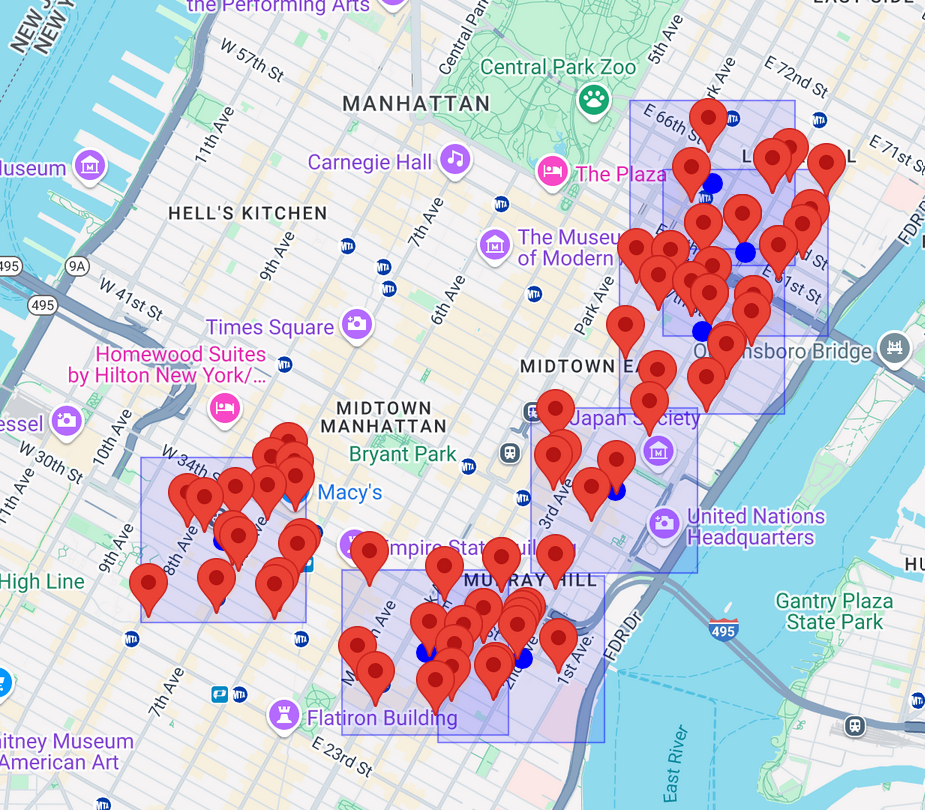
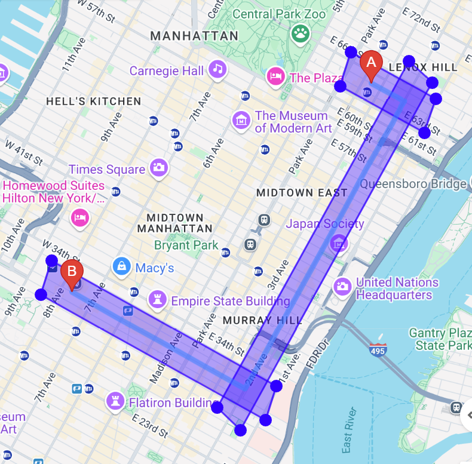
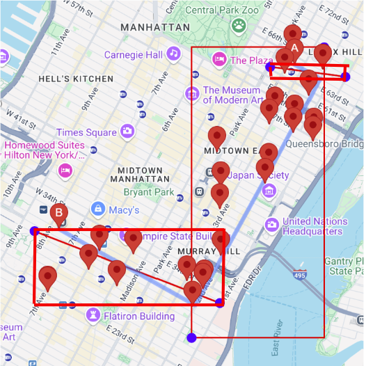
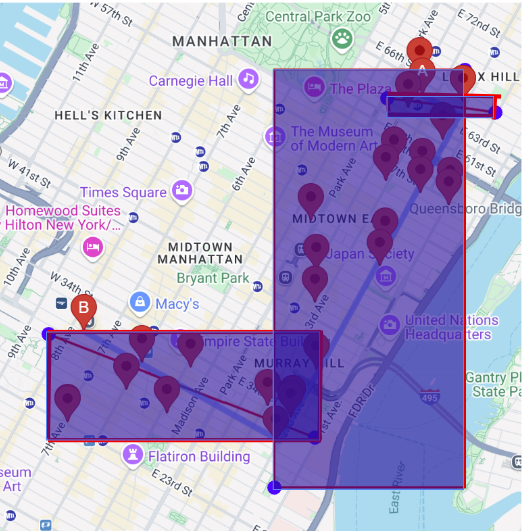

To run:

Embed your API_KEY in the script source at the very top and inside the searchNear function, and open preview

Everything is hardcoded in this test, so API Key is not secure at all. Make sure to remove it if you are going to upload some copy of this file. 

# What This File Does:

Given a set of coordinates (points along the route), this file calls the places API iteratively on each point. 

The places API will perform a nearby search based on the text query (e.g. Pizza)

This approach solves the problem of the previous week, and search results are actually restricted for text search but the boundaries must be in rectangular format 

Output: Nearby Place search on 7 coordinates along the route from Hunter College to Penn Station. 



In this file, the coordinate points are hardcoded (there are 7 predefined coordinates), and the map is centered around Hunter college. One thing to consider is making the coordinates (2D array) an input feature, and finding the optimum center of the map and zoom so that fits the entire route and search area. 


Update: This approach will not work

Since text search could be restricted to a rectangle, I thought of making a rectangle along the path line this, and limiting the searches to the rectangle shown below. 
Refer to this image below as Figure 1:


Note that the images I will show below is trying to create a restricted search area that I draw up in Figure 1 just above. As you will see, after hours of working the result was that the Google Maps TextSearch API does not allow for this, and it is impossible. 

The problem is that text search alwats draws a rectangle that is paralell to the world map provided by google. 

https://developers.google.com/maps/documentation/places/web-service/text-search
```javascript
"locationRestriction": {
  "rectangle": {
    "low": {
      "latitude": 40.477398,
      "longitude": -74.259087
    },
    "high": {
      "latitude": 40.91618,
      "longitude": -73.70018
    }
  }
}
```

To define the rectangle for location restriction, the API only takes two coordinates, which is the top left and bottom right edgepoints of the rectangle. The blue dots in the image below are the corners of the rectangles drawn in Figure 1, and the rectangle drwan in the red is the result of using those corners. 



Thus, the search area that could be restricted using a rectangle is shown below, which is very different from Figure 1. 



The problem is tha these rectangles cannot be rotated/tilted, so the search restriction rectangle cannot be made to fit the path. 

Although I spent a lot of time working on making this approach of using rectangles to restrict search along the path, it seems that this has to be abandoned and a new approach has to be found. 
