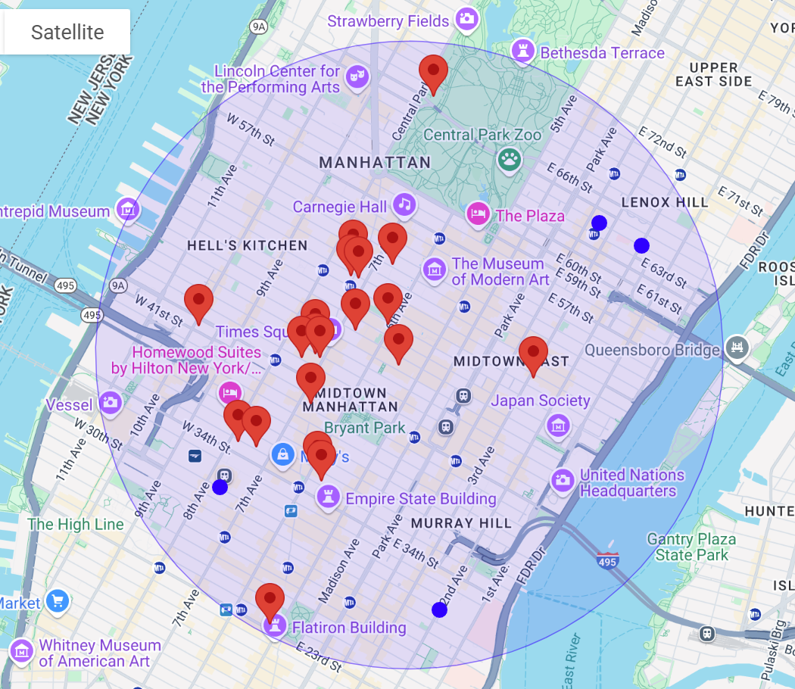
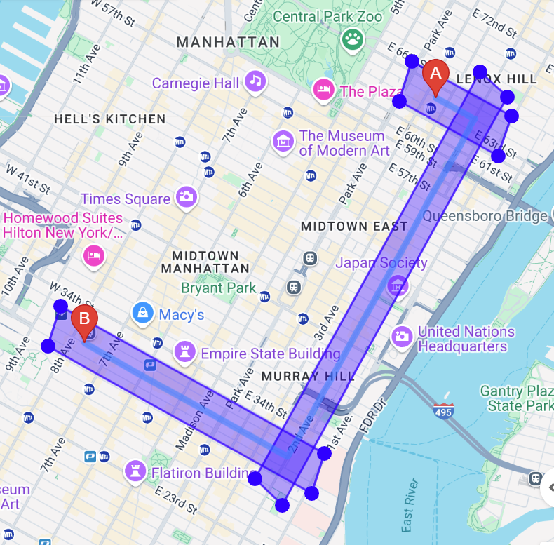
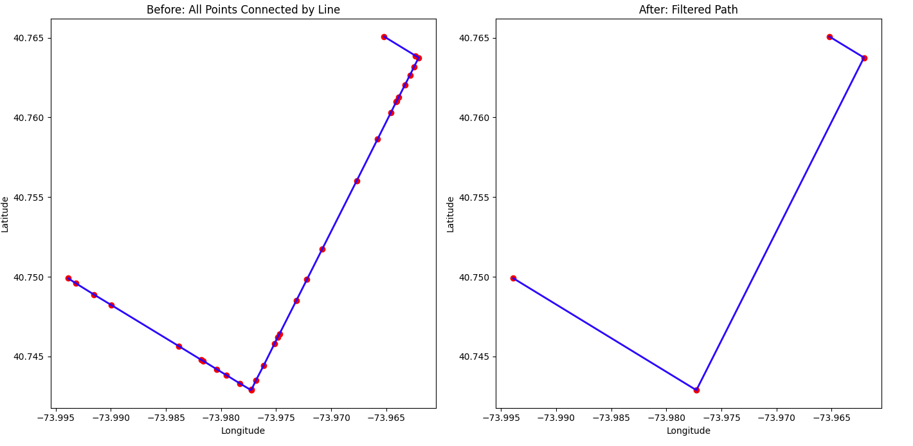

What this function does:

This week I tried to implementing an algorithm for reducing clustered coordinates. 

First, why we do we need to uncluster the coordinates?
There was a plan to make one huge API call like this:

and filter the result if any of the places fell within these boxes:

However, as you see from the first image, each API call only returns about 20 results, and they are not guarenteed to be scattered across the search radius evenly. Thus making one places API call with a large radius is not really an option. If we want as many places as possible along the route, we have to make smaller API calls more regularly, like this: (note this is just a search radius)

So this week I worked on reducing the clustered coordinates, and the algorithm I wrote (in python) does the following thing.
Given 3 consecutive coordinate points:
1. Draws a straight line from the first point to the third point
2. Measures the distance X of the second point to that line
3. If X is less than a threshold (here 50 meters), remove the second point and the third point now becomes the new second point. Else, set the second point as the first point and continue
4. Repeat until all the coordinates 3 triplets have been traveresed through

The output is as follows, where the coordinates (red dots) in the left have been reduced to the coordinates in the right. 

I also translated this process to a javascript function shown in reduce.js